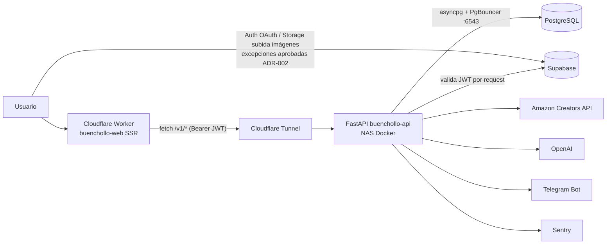

# AUDIT_REPORT — BuenCholloTech

> Auditoría técnica completa previa a una nueva fase de desarrollo.
> Fecha: **2026-07-16** · Rama auditada: `develop` (= `main` salvo el rediseño del header)
> Método: análisis estático + lectura de código + ejecución real de lint, typecheck,
> tests, build y auditorías de dependencias. Todas las afirmaciones citan evidencia
> del repositorio. Complementa (no sustituye) a `docs/reference/SECURITY_AUDIT.md`
> y a la auditoría final de junio 2026.

---

## 1. Resumen ejecutivo

**Estado general: sano.** La base es un monolito modular con Clean Architecture
pragmática, en producción real (`buenchollotech.com`), con CI de 4 jobs, 208 tests
automatizados verdes, seguridad endurecida (RLS, CSP, rate limiting, SSRF allowlist,
gitleaks) y documentación de nivel notablemente superior a la media.

**Nivel de riesgo: BAJO.** No hay ningún hallazgo crítico. No hay secretos
versionados (`git ls-files` solo muestra `*.env.example`), no hay llamadas directas
del frontend a la BD (ADR-002 verificado al 100%: cero `supabase.from()`/`rpc()`),
y las validaciones ejecutadas hoy pasan todas:

| Validación | Resultado |
|---|---|
| Backend `pytest -m "not integration"` (Python 3.11) | ✅ **100 passed** (109 recolectados, 9 integración) |
| Frontend `tsc --noEmit` | ✅ 0 errores |
| Frontend `eslint` | ✅ 0 errores (9 warnings inocuos) |
| Frontend `vitest run` | ✅ **91 passed** (12 archivos) |
| Frontend `vite build` (producción) | ✅ OK en 42 s |
| `pip-audit` (deps producción backend) | ✅ 0 vulnerabilidades |
| `npm audit --omit=dev` | ⚠️ **15 avisos (4 high)** — ver H-01 |

**Debilidades principales:** vulnerabilidades npm pendientes con fix disponible
(H-01), la latencia conocida de producción tiene una causa adicional no registrada
— un round-trip HTTP a Supabase Auth **por cada request autenticada** (H-02) —,
el contenedor Docker corre como root con el código montado por volumen (M-01), y
el registro de deuda técnica está desactualizado: TD-02 ya está resuelto en código
y TD-01 queda desbloqueado con las cifras verificadas hoy (M-03).

**Veredicto anticipado: LISTO PARA CONTINUAR CON CORRECCIONES MENORES.**
Se puede desarrollar encima de esta base con seguridad. Antes de los cambios
grandes conviene cerrar H-01 (una tarde) y decidir el enfoque de H-02.

---

## 2. Mapa de arquitectura actual

**Stack:** Python 3.11 · FastAPI · SQLAlchemy async/asyncpg · Alembic · Pydantic v2
(backend) — React 19 · TypeScript strict · TanStack Router/Start (SSR) · TanStack
Query · Vite · Tailwind · shadcn/ui (frontend) — PostgreSQL vía Supabase (PgBouncer
:6543) — npm y pip como gestores.

**Infraestructura:** frontend como Cloudflare Worker (deploy automático al hacer
push a `main`); API en NAS Synology (Docker) expuesta por Cloudflare Tunnel;
Supabase para Auth (Google OAuth), Storage y BD. Sentry (backend). Telegram y
Amazon Creators API como integraciones salientes; OpenAI para autocompletado.

**Backend** (`buenchollo-api/app/`): `core/` (config, database, security, logging,
rate_limit, request_id, security_headers, health, sentry, audit, exceptions) +
9 módulos en `modules/` (deals, products, categories, stores, users, telegram,
alerts, notifications, comments), cada uno con `api / application / domain /
infrastructure`. Flujo de dependencias correcto: `api → application → domain ←
infrastructure`. API versionada bajo `/v1` ([main.py:182-194](buenchollo-api/app/main.py#L182-L194));
`/health` y `/health/ready` fuera del versionado.

**Frontend** (`buenchollo-web/src/`): `services/api/` (única puerta al backend,
[client.ts](buenchollo-web/src/services/api/client.ts)), `routes/` (file-based),
`features/{deals,admin,auth,notifications,telegram}/` (componentes + hooks por
dominio), `components/layout/` y `components/ui/` (shadcn), `lib/` (validación Zod,
errores, formato, constantes).

**Flujos críticos:** publicación de chollos (admin → API → BD → notificación
Telegram + alertas), exploración/búsqueda pública, favoritos/votos/comentarios
(autenticados), preview de producto Amazon con IA, panel admin completo con audit
log, scheduler de expiración/activación cada 5 min ([main.py:40-67](buenchollo-api/app/main.py#L40-L67)).

---

## 3. Puntuación por áreas

| Área | Nota | Justificación |
|---|---:|---|
| Arquitectura | **9** | Clean Architecture real y consistente; DIP con Protocols; módulos sin acoplamiento cruzado; API versionada. Resta: capa `application/` ausente en `categories`/`stores` (TD-04, aceptado). |
| Calidad de código | **8.5** | TypeScript strict + ESLint duro sin errores; 0 `any`; 0 TODO/FIXME reales; backend con archivos ≤ 337 líneas. Resta: `admin.chollos.tsx` con 999 líneas (TD-03) y 1 import muerto. |
| Seguridad | **8** | RLS activado, CSP + headers, rate limiting, SSRF allowlist, gitleaks en CI, errores sanitizados, sin secretos en repo. Resta: 4 high de npm sin aplicar (H-01), contenedor root (M-01). |
| Rendimiento | **6.5** | Índices compuestos aplicados, selectinload centralizado, paginación con límites. Resta: TD-11 abierto, round-trip auth por request (H-02), uvicorn mono-proceso, sin caché HTTP. |
| Base de datos | **8.5** | Alembic con 6 migraciones y auto-upgrade al arrancar; UUIDs consistentes; `statement_cache_size=0` para PgBouncer; audit log con SAVEPOINT. Resta: pool por defecto sin medir contra PgBouncer. |
| Testing | **8.5** | 208 tests reales (109 backend + 91 vitest + 8 E2E); pirámide correcta; mocks sin red; hooks pre-commit/pre-push. Resta: integración fuera de CI (TD-07), cifras sin propagar (TD-01). |
| CI/CD | **8.5** | 4 jobs (pytest, typecheck+lint+coverage, E2E, security-audit con pip-audit --strict + npm audit + gitleaks); Dependabot agrupado; deploy automático a producción. Resta: umbral npm en `critical` deja pasar los high actuales; sin verificación post-deploy automatizada. |
| Observabilidad | **7** | Backend: logs JSON + request_id + Sentry + health checks — muy bien. Resta: frontend sin error tracking (0 referencias a Sentry en `buenchollo-web/src`), 8 `console.error` (TD-08). |
| Documentación | **9** | README + 9 ADRs + docs/project + docs/master + guía viva de Cloudflare + memoria versionada. Resta: cifras de tests y PROJECT_STATUS desactualizados (M-03). |
| Escalabilidad | **7.5** | Stateless (JWT), extensión por adaptadores demostrada, módulos independientes. Resta: NAS mono-proceso como cuello (documentado y aparcado a propósito en OPTIMIZACION_PLAN.md), scheduler acoplado al proceso web (M-07). |

---

## 4. Hallazgos críticos

**Ninguno.** No se ha encontrado ninguna vulnerabilidad explotable confirmada,
secreto expuesto, riesgo de pérdida de datos ni fallo de compilación.

---

## 5. Hallazgos de prioridad alta

### H-01 · Dependencias npm con 4 avisos HIGH y fix disponible
- **Severidad:** ALTA · **Tipo:** vulnerabilidad probable (no confirmada como explotable en este despliegue)
- **Evidencia:** `npm audit --omit=dev` (ejecutado hoy): 15 avisos (2 low, 9 moderate, 4 high). Destaca `ws` 8.0.0–8.20.1 (GHSA-58qx-3vcg-4xpx, GHSA-96hv-2xvq-fx4p) arrastrado por `@supabase/realtime-js`. En junio solo constaban 2 high de esbuild (tooling); esto es deriva nueva.
- **Impacto real:** `ws` es cliente WebSocket de realtime; el frontend no usa realtime activamente, así que la explotabilidad práctica es baja, pero el gate del CI ([ci.yml:169](.github/workflows/ci.yml#L169)) está en `--audit-level=critical` y no avisará de esta acumulación.
- **Solución:** en `develop`: `npm audit fix` (hay fix sin breaking), revisar/mergear las PRs de Dependabot abiertas (`dependabot/npm_and_yarn/...`, `dependabot/pip/...`, `dependabot/github_actions/...` llevan tiempo en el remoto), CI verde y entonces a `main` — respetando la norma "deps solo en develop".
- **Esfuerzo:** 1-2 h · **Riesgo del cambio:** bajo (lockfile + suite completa de tests).

### H-02 · Validación JWT = un round-trip HTTP a Supabase por cada request autenticada
- **Severidad:** ALTA (rendimiento/disponibilidad; no es vulnerabilidad)
- **Evidencia:** [security.py:30](buenchollo-api/app/core/security.py#L30) — `supabase.auth.get_user(token)` dentro de `get_current_user`, que es `Depends` de todos los endpoints autenticados. Cada request paga: cliente → Tunnel → NAS → **HTTP a Supabase** → NAS → cliente.
- **Impacto real:** es una causa de la latencia de TD-11 que **no está registrada** en el diagnóstico actual (que apunta a `--workers` y al pool). Además convierte a Supabase Auth en punto único de fallo de *toda* la API autenticada y consume cuota.
- **Solución recomendada:** validar el JWT localmente (firma + expiración) — Supabase publica JWKS y/o firma HS256 con `SUPABASE_JWT_SECRET` (el CI ya inyecta esa variable en [ci.yml:37](.github/workflows/ci.yml#L37), señal de que estaba previsto). Mantener `get_user` solo como fallback o para revocación explícita. Documentar en un ADR el trade-off (revocación inmediata vs latencia).
- **Esfuerzo:** 0.5-1 día con tests · **Riesgo:** medio (tocar auth exige tests de expiración/firma inválida y smoke en preview antes de main).

---

## 6. Hallazgos de prioridad media

### M-01 · Contenedor API corre como root y la imagen no es inmutable
- **Evidencia:** [Dockerfile](buenchollo-api/Dockerfile) sin directiva `USER` ni `HEALTHCHECK`; [docker-compose.yml:11](buenchollo-api/docker-compose.yml#L11) monta `.:/app` pisando el código copiado en la imagen.
- **Impacto:** un compromiso de la app da root dentro del contenedor con el repo montado en escritura (incluido `.env` del NAS). El volumen hace que "lo que corre" no sea "lo que se construyó".
- **Solución:** añadir usuario no-root (`RUN useradd -m app` + `USER app`), `HEALTHCHECK` apuntando a `/health`, y valorar eliminar el volumen en producción (deploy por build). Mitigado hoy por: NAS no expuesto (túnel saliente) y WAF delante.
- **Esfuerzo:** 2-4 h + redeploy con verificación · **Riesgo:** medio (permisos de escritura de logs/volúmenes en el NAS — probar en local primero).

### M-02 · God Component `admin.chollos.tsx` (999 líneas) — TD-03, sigue creciendo
- **Evidencia:** `wc -l` hoy = 999 (986 en junio). UI + formulario + estados mezclados.
- **Impacto:** cada feature nueva de admin lo engorda; es el mayor foco de conflictos si se desarrolla en paralelo.
- **Solución:** la ya registrada en TD-03 (extraer `useAdminDeals`, `useDealForm` y subcomponentes). Buen candidato a primera tarea de la Fase 2, **antes** de añadirle más funcionalidad.
- **Esfuerzo:** 1 día · **Riesgo:** bajo-medio (cubierto por E2E; añadir tests a los hooks extraídos).

### M-03 · Registro de deuda y cifras documentales desactualizados
- **Evidencia:**
  - **TD-02 ya está resuelto en código**: [config.py:43](buenchollo-api/app/core/config.py#L43) usa `Annotated[list[str], NoDecode]` + validator, que es exactamente el fix que TD-02 pedía; `docs/project/10-technical-debt.md` lo sigue listando como deuda alta.
  - **TD-01 queda desbloqueado hoy**: pytest bajo Python 3.11 = **109 tests backend** (100 unit + 9 integración) y vitest = **91** (+8 E2E) → total real **208**. Los badges dicen 167 (raíz) y 97 (`buenchollo-api/README.md`); PROJECT_STATUS dice 158.
  - `PROJECT_STATUS.md` está fechado 2026-05-30 y no recoge nada de junio/julio (TD-10 incluido).
- **Impacto:** las docs son la gran fortaleza del proyecto (y material de TFM); la deriva la erosiona y hace perder tiempo en cada auditoría.
- **Solución:** una pasada de reconciliación: cerrar TD-02, propagar 109/91/8 a los 6 sitios listados en TD-01, refrescar PROJECT_STATUS, resolver TD-10. **No lo he tocado** (regla de no modificar sin autorización).
- **Esfuerzo:** 2-3 h · **Riesgo:** nulo.

### M-04 · Frontend sin error tracking en producción
- **Evidencia:** 0 referencias a Sentry (u otro tracker) en `buenchollo-web/src`; 8 `console.error` en rutas (TD-08).
- **Impacto:** los errores de los usuarios reales en el Worker/navegador son invisibles; el backend sí los tiene cubiertos.
- **Solución:** Sentry browser SDK (el proyecto ya tiene cuenta) con `beforeSend` filtrando PII, o al mínimo un handler global que envíe a un endpoint propio. Cierra también TD-08 de paso.
- **Esfuerzo:** 2-4 h · **Riesgo:** bajo (cuidar el peso del bundle: usar el SDK slim/lazy).

### M-05 · Tests de integración fuera de CI (TD-07)
- **Evidencia:** [ci.yml:39](.github/workflows/ci.yml#L39) `pytest -m "not integration"`; los 9 de integración solo corren en local.
- **Impacto:** regresiones de repositorios/queries reales solo se detectan manualmente antes de release.
- **Solución:** job con `services: postgres` en Actions (ya previsto en TD-07). 
- **Esfuerzo:** 2-4 h · **Riesgo:** bajo.

### M-06 · `fetchWithAuth` sin timeout ni reintentos controlados
- **Evidencia:** [client.ts:57-82](buenchollo-web/src/services/api/client.ts#L57-L82) — `fetch` sin `AbortSignal.timeout`.
- **Impacto:** con el NAS lento (TD-11), una request colgada deja spinners indefinidos; TanStack Query mitiga en las rutas migradas, pero no todas las llamadas pasan por Query.
- **Solución:** `signal: AbortSignal.timeout(15000)` por defecto en `fetchWithAuth`, sobrescribible por opción.
- **Esfuerzo:** 1-2 h con tests · **Riesgo:** bajo.

### M-07 · Scheduler acoplado al proceso web — bloquea la mejora `--workers` de TD-11
- **Evidencia:** [main.py:40-67](buenchollo-api/app/main.py#L40-L67) crea `BackgroundScheduler` en el lifespan; [docker-compose.yml:18](buenchollo-api/docker-compose.yml#L18) arranca `uvicorn` sin `--workers`.
- **Impacto:** la acción registrada en TD-11 ("añadir --workers") **duplicaría los jobs** (expiración, activación, limpieza) una vez por worker — riesgo de dobles notificaciones Telegram. Es una dependencia entre deudas que hoy no está anotada.
- **Solución:** al subir workers, mover el scheduler a un proceso/contenedor propio (mismo compose, `command` distinto) o gatear con lock (p. ej. advisory lock de Postgres). Anotarlo en TD-11.
- **Esfuerzo:** 0.5 día · **Riesgo:** medio (probar en local/preview).

---

## 7. Hallazgos de prioridad baja

| ID | Hallazgo | Evidencia | Acción |
|---|---|---|---|
| L-01 | Import muerto `Link` | `explorar.tsx:1` (warning de ESLint de hoy) | Borrarlo |
| L-02 | Capa `application/` ausente en `categories`/`stores`; `__init__.py` faltantes; excepciones de dominio incompletas | TD-04/05/06 | Mantener como deuda consciente; resolver al tocar cada módulo |
| L-03 | Telegram aún vía Supabase Functions | TD-09 | Migrar a `POST /v1/telegram/notify` cuando se toque Telegram |
| L-04 | `psycopg2-binary>=2.9` sin pin exacto (único de 20) | `requirements.txt` | Mergear la PR de Dependabot que lo acota (`>=2.9.12`) |
| L-05 | 9 warnings ESLint (8 Fast Refresh en `components/ui`, conocidos) | lint de hoy | Ignorables; regla off para `components/ui/` si molestan |
| L-06 | `get_db` hace `commit()` también en GETs | [database.py:48](buenchollo-api/app/core/database.py#L48) | Inofensivo (commit vacío); opcional: commit explícito en escrituras |
| L-07 | Sesión Supabase en `localStorage` (XSS podría robar token) | `integrations/supabase/client.ts:20` | Comportamiento estándar de supabase-js; mitigado por CSP. Documentar como riesgo aceptado en SECURITY.md |
| L-08 | Ramas Dependabot acumuladas en el remoto sin resolver | `git branch -a` | Se resuelven con H-01 |

---

## 8. Fortalezas actuales

1. **ADR-002 cumplido al 100% y verificado hoy**: cero `supabase.from()`/`rpc()` en el frontend; solo `auth` y `storage` (excepciones aprobadas y documentadas).
2. **Clean Architecture real, no decorativa**: routers solo HTTP con `Query`-validación y límites ([deals/api/router.py:38-58](buenchollo-api/app/modules/deals/api/router.py#L38-L58)), casos de uso con DI, repositorio único tocando BD, `_base_deal_query()` centralizando `selectinload` (anti-N+1).
3. **Seguridad por diseño**: RLS en las 12 tablas, CSP + security headers, HSTS solo en prod, rate limiting X-Forwarded-For aware, SSRF allowlist para Amazon, handler 500 sin origin-reflection ([main.py:148-174](buenchollo-api/app/main.py#L148-L174)), errores internos nunca expuestos, gitleaks con historial completo en CI.
4. **Calidad automatizada de verdad**: 208 tests verdes, TypeScript strict + `noUncheckedIndexedAccess`, `no-explicit-any` como error, husky pre-commit (lint+typecheck) y pre-push (tests), CI con 4 jobs y Dependabot agrupado.
5. **Operación cuidada**: Alembic auto-upgrade idempotente al arrancar (el contenedor no arranca con esquema obsoleto — decisión correcta y comentada), request_id extremo a extremo, health liveness/readiness separados, Sentry con `before_send`, audit log de admin con SAVEPOINT, y una documentación (9 ADRs + guía viva de Cloudflare + memoria versionada) excepcional para un proyecto de este tamaño.

---

## 9. Deuda técnica

Registro vivo en [docs/project/10-technical-debt.md](docs/project/10-technical-debt.md). Estado real tras esta auditoría:

| Item | Estado | Evolución si no se corrige |
|---|---|---|
| TD-01 cifras de tests | **Desbloqueado hoy** (109 backend / 91 web / 8 E2E) | Deriva documental creciente; riesgo de dato falso en TFM |
| TD-02 CORS_ORIGINS CSV | **Ya resuelto en código** — cerrar entrada | Ruido en auditorías futuras |
| TD-03 God Component admin | Abierto, creció a 999 líneas | Cada feature admin lo empeora; conflictos en paralelo |
| TD-04/05/06 capas/`__init__`/excepciones | Abiertos, tolerables | Inconsistencia arquitectónica se copia en módulos nuevos |
| TD-07 integración fuera de CI | Abierto | Regresiones de BD invisibles hasta release |
| TD-08 console.error | Abierto | Errores de usuarios invisibles (se cierra con M-04) |
| TD-09 Telegram via Functions | Abierto | Excepción a ADR-002 se perpetúa |
| TD-10 estado ADR-002 incoherente | Abierto (docs) | Confusión; el código está bien |
| TD-11 latencia producción | Abierto — **añadir H-02 y M-07 al diagnóstico** | UX degradada; primera impresión mala con usuarios reales |
| **Nueva** deps npm (H-01) | Abierta hoy | Acumulación de CVEs; el gate `critical` no avisará |

---

## 10. Plan de actuación

### Fase 0 — Bloqueantes
**Ninguno.** No hay nada que impida seguir desarrollando.

### Fase 1 — Estabilización (1-2 días)
| Tarea | Prioridad | Beneficio | Complejidad | Riesgo | Dependencias | Archivos | Aceptación |
|---|---|---|---|---|---|---|---|
| 1.1 `npm audit fix` + mergear Dependabot (H-01, L-04, L-08) | Alta | Cierra 4 high | Baja | Bajo | Ninguna | `package-lock.json`, PRs | `npm audit --omit=dev` sin high; CI verde en develop y preview OK |
| 1.2 Reconciliación documental (M-03: TD-01, TD-02, TD-10) | Alta | Docs fiables (TFM) | Baja | Nulo | 1.1 no | READMEs, `10-technical-debt.md`, `PROJECT_STATUS.md`, docs 06 | Una sola cifra (208) en todos los sitios; TD-02 cerrado |
| 1.3 Timeout en `fetchWithAuth` (M-06) | Media | UX ante NAS lento | Baja | Bajo | Ninguna | `client.ts` + test | Request colgada aborta a los 15 s con `ApiError` |
| 1.4 Borrar import muerto (L-01) | Baja | Lint limpio | Trivial | Nulo | Ninguna | `explorar.tsx` | 8 warnings restantes |

### Fase 2 — Refactorización estructural (2-4 días, incremental)
| Tarea | Prioridad | Beneficio | Complejidad | Riesgo | Dependencias | Aceptación |
|---|---|---|---|---|---|---|
| 2.1 Validación JWT local (H-02) + ADR | Alta | −1 hop por request; sin SPOF de auth | Media | Medio | Ninguna | Tests de firma/expiración/revocación; latencia medida antes/después en preview |
| 2.2 Split `admin.chollos.tsx` (M-02/TD-03) | Media | Mantenibilidad admin | Media | Bajo-medio | Hacer **antes** de nuevas features admin | ≤ 300 líneas por archivo; E2E verdes; hooks con tests |
| 2.3 Scheduler fuera del proceso web (M-07) | Media | Desbloquea `--workers` | Media | Medio | Coordinar con TD-11 | Jobs corren exactamente una vez con N workers |

### Fase 3 — Preparación para nuevas funcionalidades (paralelo a Fase 2)
| Tarea | Prioridad | Beneficio | Aceptación |
|---|---|---|---|
| 3.1 Actualizar TD-11 con H-02/M-07 y plan de medición (latencia real por tramo: Tunnel, auth, BD) | Alta | Diagnóstico completo antes de optimizar | TD-11 lista causas con datos medidos |
| 3.2 Plantilla/convención de módulo nuevo (documentar el patrón deals como referencia canónica) | Media | Los módulos nuevos nacen consistentes (evita repetir TD-04/05/06) | Doc corta en `docs/project/` |
| 3.3 CI: integración con Postgres service (M-05/TD-07) | Media | Red de seguridad completa | Los 9 tests de integración corren en CI |

### Fase 4 — Optimización (cuando haya usuarios; ya aparcado a propósito en OPTIMIZACION_PLAN.md)
- Sentry frontend (M-04) — puede adelantarse, es barato.
- `--workers` uvicorn + medición pool/PgBouncer (tras 2.3).
- Usuario no-root + HEALTHCHECK en Docker (M-01) — adelantable, no requiere usuarios.
- Caché Cloudflare para GETs públicos (`/v1/deals/latest`, `/popular`) con TTL corto.
- Umbral npm audit a `high` cuando TanStack permita actualizar vite/esbuild.

### Orden recomendado global
`1.1 → 1.2 → 1.4` (misma tanda) → `1.3` → `3.1` → `2.1` → `2.2` → `2.3` → `3.3` → Fase 4.

---

## 11. Quick wins

1. `npm audit fix` — cierra 4 high en una tarde (con CI + preview de validación).
2. Cerrar TD-02 en el registro de deuda — ya está resuelto en código; es borrar una entrada.
3. Propagar la cifra real de tests (208) — desbloqueada hoy tras correr pytest en 3.11.
4. `AbortSignal.timeout` en `client.ts` — 10 líneas, mejora percepción con NAS lento.
5. Borrar el import `Link` muerto en `explorar.tsx`.
6. `USER app` + `HEALTHCHECK` en el Dockerfile — 6 líneas (probar en local antes del NAS).

## 12. Cambios que NO deben realizarse todavía

- **Migrar infraestructura fuera del NAS / asumir gasto mensual** — decisión ya tomada y documentada en `OPTIMIZACION_PLAN.md`: esperar a base de usuarios real.
- **Microservicios, colas, eventos, Redis, GraphQL** — ninguna necesidad demostrable al volumen actual (~117 deals); el monolito modular es la decisión correcta.
- **Reescribir el God Component desde cero** — extraer hooks incrementalmente (2.2), no rehacer.
- **Subir el gate de npm audit a `high` hoy** — bloquearía el CI por los esbuild HIGH de tooling que no tienen fix compatible (documentado en [ci.yml:159-167](.github/workflows/ci.yml#L159-L167)); hacerlo cuando TanStack actualice vite.
- **Añadir `--workers` a uvicorn sin resolver antes M-07** — duplicaría los jobs del scheduler (dobles notificaciones Telegram).
- **Cambiar el patrón de sesión de Supabase (localStorage → cookies)** — coste alto, beneficio marginal con la CSP actual; reevaluar si aparece una feature con contenido de terceros.

## 13. Veredicto final

## ✅ LISTO PARA CONTINUAR CON CORRECCIONES MENORES

La base está bien estructurada, es segura, mantenible y extensible; el patrón de
módulos y adaptadores permite añadir funcionalidades sin tocar el resto del
sistema (demostrado: añadir un proveedor = un adaptador). Las correcciones
recomendadas antes de los cambios grandes son la Fase 1 (1-2 días) y la decisión
sobre H-02; nada de ello bloquea empezar a desarrollar ya.

---

### Anexo — Comandos ejecutados y cambios realizados durante la auditoría

| Comando | Resultado |
|---|---|
| `pytest -q -m "not integration"` (Python 3.11, venv limpio) | 100 passed en 5.97 s |
| `pytest --collect-only` | 109 tests |
| `pip-audit -r requirements.txt` | 0 vulnerabilidades |
| `npm run lint` | 0 errores, 9 warnings |
| `npm run typecheck` (`tsc --noEmit`) | 0 errores |
| `npm run test:run` | 91 passed (12 archivos) |
| `npm run build` | OK, 42 s |
| `npm audit --omit=dev` | 15 avisos (4 high) → H-01 |

**Incidencia de entorno (no del proyecto):** los `.venv` locales (raíz y
`buenchollo-api/`) están en Python **3.14** mientras el proyecto usa **3.11**;
para ejecutar pytest se creó un venv 3.11 temporal **fuera del repositorio**
(scratchpad). Recomendación: recrear `buenchollo-api/.venv` con `py -3.11 -m venv .venv`.

**Cambios realizados en el repositorio: únicamente la creación de este archivo
(`AUDIT_REPORT.md`).** No se ha modificado, eliminado ni refactorizado ningún
código ni documento. (Nota: `npm rebuild` se ejecutó en la sesión, previo a la
auditoría, para restaurar `node_modules/.bin` perdido en la copia de carpetas —
no toca código versionado.)
