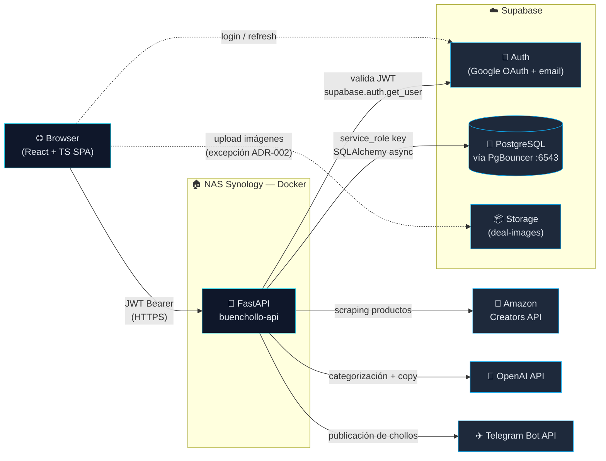

<p align="center">
  
</p>

<h1 align="center">BuenCholloTech</h1>

<p align="center">
  <a href="https://github.com/Zambudio/buenchollo-app/actions/workflows/ci.yml">
    
  </a>
  <a href="https://github.com/Zambudio/buenchollo-app/releases/tag/v1.0.0-tfm">
    
  </a>
  
  
</p>

Plataforma para publicar, gestionar y automatizar chollos tecnológicos.
Proyecto dual: producto personal en evolución continua + Trabajo Final del
Máster en Desarrollo con IA 2025.

---

## Arquitectura

**Monolito Modular con Clean Architecture pragmática** ([ADR-001](docs/adr/ADR-001-monolito-modular-fastapi.md))
y **patrón API Gateway** ([ADR-002](docs/adr/ADR-002-migracion-baas-a-api-gateway.md)):
el frontend nunca llama a la BD directamente; toda la lógica de negocio vive
en FastAPI.



### Filosofía arquitectónica (6 reglas inviolables)

1. **El router sólo habla HTTP** — recibe request, llama al caso de uso,
   devuelve respuesta. Sin SQL ni lógica de negocio.
2. **Casos de uso en `application/`** — toda la orquestación va ahí,
   independiente de FastAPI y de la BD.
3. **El repositorio es el único que toca la BD** — ningún `session.execute()`
   fuera de `infrastructure/`.
4. **Módulos sin acoplamiento cruzado** — lo compartido va a `core/`.
5. **Un proveedor externo = un adaptador en `infrastructure/`** — añadir
   AliExpress es crear `aliexpress_client.py` y registrarlo. Nada más cambia.
6. **El frontend nunca habla con la BD directamente** — excepción documentada
   para Supabase Auth y Storage ([ADR-002](docs/adr/ADR-002-migracion-baas-a-api-gateway.md)).

### Decisiones arquitectónicas (ADRs)

| # | Decisión | Estado |
|---|---|---|
| [ADR-001](docs/adr/ADR-001-monolito-modular-fastapi.md) | Monolito Modular con FastAPI y Clean Architecture pragmática | Aceptado (refinado por ADR-002) |
| [ADR-002](docs/adr/ADR-002-migracion-baas-a-api-gateway.md) | Migración de BaaS directo a API Gateway | Aceptado · cumplido al 100% |
| [ADR-003](docs/adr/ADR-003-autenticacion-supabase-jwt.md) | Autenticación con Supabase Auth + validación de JWT en backend | Aceptado |
| [ADR-004](docs/adr/ADR-004-persistencia-sqlalchemy-pgbouncer.md) | Persistencia con SQLAlchemy async + asyncpg + PgBouncer | Aceptado |
| [ADR-005](docs/adr/ADR-005-validacion-doble-frontera.md) | Validación en doble frontera con Zod y Pydantic | Aceptado |
| [ADR-006](docs/adr/ADR-006-rls-service-role.md) | Hardening de RLS y separación `anon` / `service_role` | Aceptado |
| [ADR-007](docs/adr/ADR-007-di-fastapi-depends.md) | Inyección de dependencias con `Depends` de FastAPI | Aceptado |

---

## Estructura del monorepo

```
buenchollo-app/
├── buenchollo-api/             # Backend FastAPI
│   ├── app/
│   │   ├── core/               # config, database, security, logging
│   │   ├── modules/            # 1 carpeta por dominio (deals, products, …)
│   │   │   └── <modulo>/
│   │   │       ├── domain/         # modelos SQLAlchemy + reglas puras
│   │   │       ├── application/    # casos de uso (services)
│   │   │       ├── infrastructure/ # repositorios + adaptadores externos
│   │   │       └── api/            # router FastAPI + schemas Pydantic
│   │   └── tests/              # unitarios + integración
│   ├── alembic/                # migraciones versionadas
│   └── supabase/migrations/    # histórico SQL pre-Alembic
│
├── buenchollo-web/             # Frontend React + TS
│   └── src/
│       ├── routes/             # TanStack Router file-based
│       ├── components/
│       │   ├── layout/         # Header, Footer, Logo, CategoriesDrawer
│       │   └── ui/             # shadcn primitives
│       ├── features/           # 1 carpeta por dominio (deals, admin, notifications, telegram)
│       │   └── <dominio>/
│       │       ├── components/ # componentes específicos del dominio
│       │       └── hooks/      # hooks con TanStack Query
│       ├── services/api/       # apiClient + servicios por dominio
│       ├── lib/                # query-client, format, errors, constants, validation
│       ├── hooks/              # useAuth y similares
│       └── integrations/       # supabase client + lovable
│
├── .github/
│   ├── workflows/ci.yml        # pytest + tsc + eslint en cada push/PR
│   └── dependabot.yml          # updates semanales agrupados
│
└── docs/                       # ADRs + planes + diagramas
    ├── adr/                    # 7 ADRs (arriba)
    ├── PLAN_ARQUITECTURA.md    # plan vivo de hardening
    ├── SMOKE_TEST.md           # checklist manual pre-release
    ├── SUPABASE_SETUP.md       # esquema BD + configuración
    └── LAUNCH_CHECKLIST.md     # pre-flight para producción
```

| Subrepo | Stack | Rol |
|---|---|---|
| `buenchollo-api/` | Python 3.11 · FastAPI · SQLAlchemy 2.x · asyncpg · Pydantic v2 | API Gateway — toda la lógica de negocio |
| `buenchollo-web/` | React 18 · TypeScript · Vite · TanStack Router · Zod · shadcn/Tailwind | Frontend — sólo habla con buenchollo-api |
| `docs/` | Markdown | ADRs, planes y documentación técnica |

---

## Prerequisitos

| Herramienta | Versión | Necesario para |
|---|---|---|
| Git | cualquiera | clonar el repo |
| Python | **3.11+** | backend |
| Node.js | 18+ | frontend |
| pnpm | 8+ | gestión de paquetes frontend (`npm install -g pnpm`) |
| Docker + Docker Compose | cualquiera | despliegue en NAS / producción |

---

## Setup desde cero

### 1. Clonar el repositorio

```bash
git clone https://github.com/Zambudio/buenchollo-app.git
cd buenchollo-app
```

### 2. Backend (`buenchollo-api`)

```bash
cd buenchollo-api

# Crear entorno virtual
python -m venv .venv

# Activar (Linux/Mac)
source .venv/bin/activate
# Activar (Windows PowerShell)
.venv\Scripts\Activate.ps1

# Instalar dependencias
pip install -r requirements.txt
pip install -r requirements-dev.txt   # tests

# Configurar variables de entorno
cp .env.example .env
# Editar .env con tus credenciales (ver buenchollo-api/README.md)

# Arrancar en modo desarrollo
uvicorn app.main:app --reload
```

API disponible en `http://localhost:8000` · OpenAPI en `http://localhost:8000/docs`.

### 3. Frontend (`buenchollo-web`)

En una terminal nueva:

```bash
cd buenchollo-web

# Instalar dependencias
pnpm install

# Configurar variables de entorno
cp .env.example .env.local
# Editar con la URL pública del backend y las keys de Supabase (anon)

# Arrancar en modo desarrollo
pnpm dev
```

Web disponible en `http://localhost:8080` (o el puerto que indique Vite).

---

## Despliegue en producción (NAS Synology)

Ver instrucciones detalladas en
[`buenchollo-api/DEPLOY_NAS.md`](buenchollo-api/DEPLOY_NAS.md).

Flujo resumido:

1. `git pull` en el NAS (o esperar a que SynologyDrive sincronice).
2. `docker-compose build --no-cache && docker-compose up -d`.
3. Verificar: `https://[tu-ddns]:8000/health`.
4. Revisar la guía completa de despliegue en [`docs/project/08-deployment.md`](docs/project/08-deployment.md).

---

## Tests

**Suite backend: 87 tests** (78 unitarios + 9 de integración).

```bash
cd buenchollo-api
python -m pytest                          # toda la suite (requiere Postgres real para los de integración)
python -m pytest -m "not integration"     # sólo unitarios (lo que corre el CI)
python -m pytest app/tests/test_deal_service.py -v   # un fichero concreto
```

Los unitarios mockean Supabase, Amazon y la BD; los de integración usan
una BD Postgres real (marcador `@pytest.mark.integration`). El workflow
de GitHub Actions ejecuta únicamente los unitarios; los de integración
se validan en local antes de cada release (ver
[`docs/SMOKE_TEST.md`](docs/SMOKE_TEST.md)).

**Frontend**:

```bash
cd buenchollo-web
npm run typecheck       # tsc --noEmit con strict mode
npm run lint            # eslint con reglas estrictas
```

---

## Documentación técnica

La documentación se organiza en **dos bloques** claramente separados:

### 📘 Operativa del repositorio — [`docs/project/`](docs/project/00-index.md)

Útil para instalar, ejecutar, mantener y evolucionar BuenCholloTech.

| Documento | Contenido |
|---|---|
| [`01-overview.md`](docs/project/01-overview.md) | Qué es, problema, módulos, roles, flujo |
| [`02-installation-and-setup.md`](docs/project/02-installation-and-setup.md) | Clonado, backend, frontend, Supabase |
| [`03-project-structure.md`](docs/project/03-project-structure.md) | Monorepo, Clean Architecture, features, UI System |
| [`04-configuration.md`](docs/project/04-configuration.md) | Variables de entorno (backend, frontend, CI) |
| [`05-development-workflow.md`](docs/project/05-development-workflow.md) | Husky, commits, uso de IA |
| [`06-testing-and-quality.md`](docs/project/06-testing-and-quality.md) | Comandos, gates, coverage, métricas |
| [`07-security.md`](docs/project/07-security.md) | Controles, política `--no-verify`, incidentes |
| [`08-deployment.md`](docs/project/08-deployment.md) | NAS Synology + Docker, dominio definitivo |
| [`09-troubleshooting.md`](docs/project/09-troubleshooting.md) | Errores comunes y soluciones |

### 🎓 Defensa del TFM — [`docs/master/`](docs/master/00-index.md)

Documentación formal para defender el proyecto ante tribunal.

| Documento | Contenido |
|---|---|
| [`01-introduccion-del-proyecto.md`](docs/master/01-introduccion-del-proyecto.md) | Contexto y motivación |
| [`02-objetivos-y-alcance.md`](docs/master/02-objetivos-y-alcance.md) | Objetivo general, específicos, alcance |
| [`03-analisis-funcional.md`](docs/master/03-analisis-funcional.md) | Usuarios, funcionalidades, flujos |
| [`04-arquitectura-y-decisiones-tecnicas.md`](docs/master/04-arquitectura-y-decisiones-tecnicas.md) | Arquitectura + ADRs |
| [`05-buenas-practicas-y-principios-de-diseno.md`](docs/master/05-buenas-practicas-y-principios-de-diseno.md) | SOLID, DRY, KISS, YAGNI |
| [`06-calidad-testing-y-refactorizacion.md`](docs/master/06-calidad-testing-y-refactorizacion.md) | Pirámide, coverage estratégico, métricas |
| [`07-seguridad.md`](docs/master/07-seguridad.md) | Security by Design + Default + OWASP |
| [`08-uso-de-ia-en-el-desarrollo.md`](docs/master/08-uso-de-ia-en-el-desarrollo.md) | Claude Code, prompts, supervisión humana |
| [`09-limitaciones-y-mejoras-futuras.md`](docs/master/09-limitaciones-y-mejoras-futuras.md) | Deuda asumida, evolución |
| [`10-conclusiones.md`](docs/master/10-conclusiones.md) | Cierre académico |

### 📐 Decisiones arquitectónicas — [`docs/adr/`](docs/adr/00-index.md)

9 ADRs firmados que documentan las decisiones clave: monolito modular,
API Gateway, autenticación, persistencia, validación doble frontera,
RLS, DI, estrategia de calidad y uso de IA.

### 📚 Referencias técnicas — [`docs/reference/`](docs/reference/)

- [`PLAN_ARQUITECTURA.md`](docs/reference/PLAN_ARQUITECTURA.md) — Sprint de hardening F1–F7 completado.
- [`SECURITY_AUDIT.md`](docs/reference/SECURITY_AUDIT.md) — Auditoría OWASP Top 10 con 10 hallazgos.
- [`SMOKE_TEST.md`](docs/reference/SMOKE_TEST.md) — Checklist manual pre-release.

### 📌 Documentos en raíz

| Documento | Contenido |
|---|---|
| [`PROJECT_STATUS.md`](PROJECT_STATUS.md) | Bitácora viva (CHANGELOG en prosa) |
| [`SECURITY.md`](SECURITY.md) | Política de divulgación responsable (convención GitHub) |
| [`CLAUDE.md`](CLAUDE.md) | Instrucciones permanentes para asistentes de IA |
| [`buenchollo-api/MIGRATIONS.md`](buenchollo-api/MIGRATIONS.md) | Setup Alembic |

### 🗃️ Histórico

Documentos antiguos preservados en [`docs/archive/`](docs/archive/) con
índice del motivo de cada movido.

---

*Desarrollado por Pedro Zambudio · Máster en Desarrollo con IA 2025*
