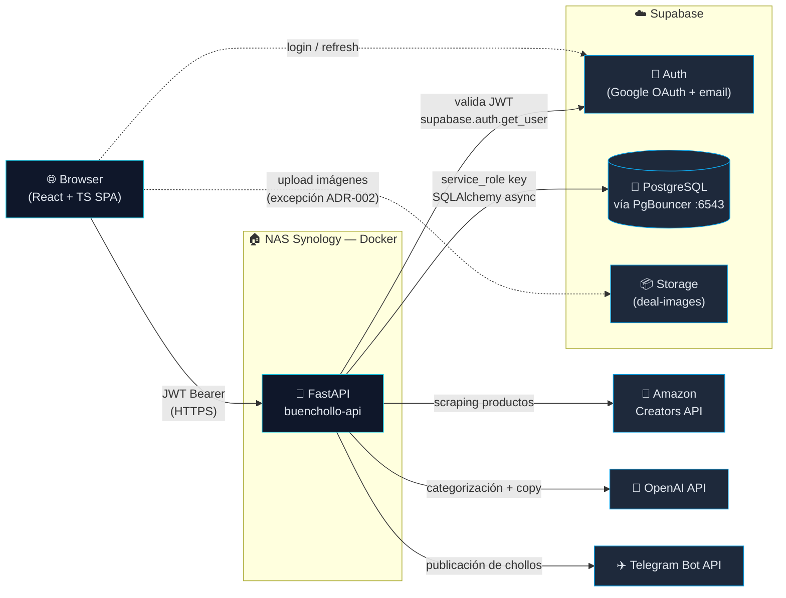

<p align="center">
  
</p>

<h1 align="center">BuenCholloTech</h1>

<p align="center">
  <strong>Plataforma de comunidad de chollos tecnológicos</strong><br>
  <em>Producto personal en producción + Trabajo Final del Máster en Desarrollo con IA 2025</em>
</p>

<p align="center">
  <a href="https://github.com/Zambudio/buenchollo-app/actions/workflows/ci.yml">
    
  </a>
  <a href="https://github.com/Zambudio/buenchollo-app/releases/tag/v1.0.0-tfm">
    
  </a>
  
  
  
  
</p>

---

## 🎓 Entrega · Trabajo Final de Máster

> Materiales de defensa del TFM: la presentación en diapositivas y el vídeo explicativo del proyecto.

| Entregable | Ubicación |
|---|---|
| 🖥️ **Slides de la presentación** | [`presentacion/BuenCholloTech-TFM.pptx`](presentacion/BuenCholloTech-TFM.pptx) |
| 🎥 **Vídeo de presentación** | ▶️ _Pendiente de publicar_ — sustituir por el enlace de YouTube: `https://youtu.be/XXXXXXXXXXX` |

---

## 📖 ¿Qué es BuenCholloTech?

Plataforma web tipo comunidad para descubrir, publicar y automatizar
**ofertas tecnológicas**. Combina la curación humana del admin con un
sistema de alertas personalizadas, votación comunitaria y publicación
automatizada al canal de Telegram del proyecto.

> 💡 **Producto real desplegado en un NAS Synology con arquitectura
> profesional**, no un prototipo académico desechable.

---

## ✨ Funcionalidades principales

Organizadas por rol de usuario:

- **👀 Visitante** — explorar chollos publicados, filtrar por categoría y tienda,
  ver el detalle de cada oferta y acceder al enlace de afiliado.
- **🔑 Usuario registrado** — crear **alertas personalizadas** por palabra clave y
  categoría, recibir notificaciones cuando entra un chollo que encaja, marcar
  **favoritos** y **votar** los chollos de la comunidad.
- **🛠️ Administrador** — publicar y editar chollos, **autocomplete desde una URL de
  Amazon** (feature estrella: rellena producto, precio e imagen automáticamente),
  **categorización y copy generados con IA**, **publicación automática al canal de
  Telegram**, panel de administración y **audit log** de las acciones admin.

📐 Detalle funcional, perfiles y flujos: [`docs/master/03 · Análisis funcional`](docs/master/03-analisis-funcional.md).

---

## 🏛️ Arquitectura

**Monolito Modular con Clean Architecture pragmática**
([ADR-001](docs/adr/ADR-001-monolito-modular-fastapi.md)) y **patrón
API Gateway** ([ADR-002](docs/adr/ADR-002-migracion-baas-a-api-gateway.md)):
el frontend nunca llama a la BD directamente; toda la lógica de
negocio vive en FastAPI.



### 📜 Filosofía arquitectónica — 6 reglas inviolables

```
1. 🌐 El router sólo habla HTTP — recibe, llama al caso de uso, devuelve
2. 🎯 Casos de uso en application/ — sin FastAPI ni BD acoplados
3. 💾 El repositorio es el único que toca la BD
4. 🧱 Módulos sin acoplamiento cruzado — lo común va a core/
5. 🔌 Un proveedor externo = un adaptador en infrastructure/
6. 🚪 El frontend nunca habla con la BD directamente
```

📐 Detalle completo: [`docs/master/04 · Arquitectura`](docs/master/04-arquitectura-y-decisiones-tecnicas.md).

---

## 📋 9 ADRs firmados

| # | Decisión | Estado |
|---|---|---|
| [ADR-001](docs/adr/ADR-001-monolito-modular-fastapi.md) | 📐 Monolito Modular con FastAPI y Clean Architecture pragmática | ✅ Aceptado |
| [ADR-002](docs/adr/ADR-002-migracion-baas-a-api-gateway.md) | 🚪 Migración de BaaS directo a API Gateway | ✅ 100% cumplido |
| [ADR-003](docs/adr/ADR-003-autenticacion-supabase-jwt.md) | 🔐 Autenticación con Supabase Auth + JWT en backend | ✅ Aceptado |
| [ADR-004](docs/adr/ADR-004-persistencia-sqlalchemy-pgbouncer.md) | 💾 SQLAlchemy async + asyncpg + PgBouncer | ✅ Aceptado |
| [ADR-005](docs/adr/ADR-005-validacion-doble-frontera.md) | 🛡️ Validación en doble frontera (Zod + Pydantic) | ✅ Aceptado |
| [ADR-006](docs/adr/ADR-006-rls-service-role.md) | 🔒 Hardening RLS + separación anon / service_role | ✅ Aceptado |
| [ADR-007](docs/adr/ADR-007-di-fastapi-depends.md) | 🧬 DI con `Depends` de FastAPI | ✅ Aceptado |
| [ADR-008](docs/adr/ADR-008-estrategia-calidad-testing.md) | 🧪 Estrategia de calidad y testing 100/80/0 | ✅ Aceptado |
| [ADR-009](docs/adr/ADR-009-uso-de-ia-en-desarrollo.md) | 🤖 Uso de IA como apoyo supervisado | ✅ Aceptado |

---

## 🌳 Estructura del monorepo

```
buenchollo-app/
│
├── 🐍 buenchollo-api/             Backend FastAPI
│   ├── app/
│   │   ├── core/                  config · database · security ·
│   │   │                          logging · request_id · rate_limit ·
│   │   │                          security_headers · sentry · audit
│   │   └── modules/<dominio>/
│   │       ├── domain/            modelos SQLAlchemy + reglas puras
│   │       ├── application/       casos de uso (services)
│   │       ├── infrastructure/    repositorios + adaptadores externos
│   │       └── api/               router FastAPI + schemas Pydantic
│   ├── alembic/                   migraciones versionadas
│   └── supabase/migrations/       histórico SQL pre-Alembic
│
├── ⚛️ buenchollo-web/             Frontend React + TS
│   └── src/
│       ├── routes/                file-based routing
│       ├── features/<dominio>/    components + hooks de cada dominio
│       ├── components/layout/     chrome compartido
│       ├── components/ui/         primitivos shadcn
│       ├── services/api/          único cliente HTTP
│       └── lib/                   CORE: lógica pura (coverage ≥90%)
│
├── ⚙️ .github/
│   ├── workflows/ci.yml           CI con 4 jobs
│   └── dependabot.yml             updates semanales agrupados
│
└── 📚 docs/                       Documentación dual
    ├── project/                   operativa (instalar, ejecutar, ...)
    ├── master/                    bloque académico del Máster
    ├── adr/                       9 ADRs firmados
    ├── reference/                 referencias técnicas densas
    └── archive/                   histórico preservado
```

---

## ⚙️ Stack

<table>
<thead>
<tr><th>Capa</th><th>Tecnología</th><th>Rol</th></tr>
</thead>
<tbody>
<tr>
  <td>⚛️ Frontend</td>
  <td>React 19 · TypeScript strict · Vite · TanStack Router/Query · Tailwind · shadcn/ui</td>
  <td>UI tipo SPA con SSR opcional</td>
</tr>
<tr>
  <td>🐍 Backend</td>
  <td>Python 3.11 · FastAPI 0.136 · SQLAlchemy 2 async · asyncpg · Pydantic v2</td>
  <td>API Gateway con toda la lógica de negocio</td>
</tr>
<tr>
  <td>💾 BD + Auth + Storage</td>
  <td>Supabase (Postgres + Auth + Storage)</td>
  <td>Managed con RLS activado en 12 tablas</td>
</tr>
<tr>
  <td>🤖 Integraciones</td>
  <td>Amazon Creators API · OpenAI GPT-4o · Telegram Bot · Sentry</td>
  <td>Autocomplete · copy IA · publicación · error tracking</td>
</tr>
<tr>
  <td>🚀 Deploy</td>
  <td>NAS Synology DSM 7.2+ · Docker Compose · Let's Encrypt</td>
  <td>Producción doméstica con HTTPS</td>
</tr>
<tr>
  <td>⚙️ CI/CD</td>
  <td>GitHub Actions (4 jobs) · Husky · Dependabot</td>
  <td>Quality gates + audit semanal</td>
</tr>
</tbody>
</table>

---

## ✅ Requisitos

| Herramienta | Versión |
|---|---|
| 📦 Git | cualquiera |
| 🐍 Python | **3.11+** |
| 🟢 Node.js | **20+** (LTS) |
| 📦 npm | **10+** (viene con Node 20) |
| 🐳 Docker + Compose | opcional para deploy NAS |

---

## 🚀 Setup rápido

```bash
git clone https://github.com/Zambudio/buenchollo-app.git
cd buenchollo-app

# 🪝 Instalar Husky (hooks de calidad)
npm install

# 🐍 Backend
cd buenchollo-api
python -m venv .venv && .venv\Scripts\Activate.ps1
pip install -r requirements-dev.txt
cp .env.example .env  # editar con valores reales
uvicorn app.main:app --reload --port 8000

# ⚛️ Frontend (otra terminal)
cd buenchollo-web
npm install
cp .env.example .env.local  # editar con valores reales
npm run dev
```

> 📚 Setup completo, incluida configuración de Supabase Auth + RLS:
> [`docs/project/02 · Instalación y setup`](docs/project/02-installation-and-setup.md).

---

## 🧪 Tests y calidad

> 📊 **167 tests automatizados verdes en ~13 segundos** (137 unit + 13 integration + 8 E2E).

```bash
# 🐍 Backend
cd buenchollo-api
pytest -q -m "not integration"   # 78 unitarios + 9 security tests
pytest -q                         # incluye 9 integración con BD real

# ⚛️ Frontend
cd buenchollo-web
npm run test:run                  # 72 tests Vitest unit + integration
npm run test:e2e                  # 8 Playwright chromium
npm run quality                   # lint + typecheck + test:run
npm run quality:full              # + E2E
```

📚 Estrategia completa: [`docs/master/06 · Calidad`](docs/master/06-calidad-testing-y-refactorizacion.md).

---

## 🛡️ Seguridad

| Control | Estado |
|---|---|
| 🔐 JWT validado server-side en cada request | ✅ |
| 🛠️ `require_admin` con SQL parametrizado (47 ocurrencias) | ✅ |
| 🛡️ Security Headers (CSP, X-Frame, HSTS prod, ...) | ✅ |
| ⏱️ Rate limiting por IP en endpoints sensibles | ✅ |
| 📋 Audit log de acciones admin con `request_id` | ✅ |
| 🔒 RLS Supabase en 12 tablas | ✅ |
| 🚫 SSRF allowlist Amazon + bloqueo IPs privadas | ✅ |
| ✅ `pip-audit` → 0 CVEs | ✅ |
| ✅ `npm audit --omit=dev` → 0 high+ | ✅ |
| 🔍 Auditoría OWASP Top 10 completa | ✅ |

📚 Detalle: [`docs/project/07 · Seguridad`](docs/project/07-security.md)
y [`docs/reference/SECURITY_AUDIT.md`](docs/reference/SECURITY_AUDIT.md).

---

## 🚀 Despliegue

```bash
# En el NAS (carpeta del proyecto)
git pull
docker-compose build --no-cache && docker-compose up -d

# Verificar
curl -s https://embyzambu.synology.me:8000/health
```

> ✅ El contenedor ejecuta `alembic upgrade head` antes de uvicorn:
> migraciones automáticas sin SSH al NAS.

📚 Guía completa: [`docs/project/08 · Despliegue`](docs/project/08-deployment.md).

---

## 📚 Documentación

La documentación se organiza en **dos bloques** claramente separados:

### 📘 Operativa del repositorio — [`docs/project/`](docs/project/00-index.md)

> _Útil para instalar, ejecutar, mantener y evolucionar BuenCholloTech._

| Documento | Contenido |
|---|---|
| [01 · Overview](docs/project/01-overview.md) | 🌅 Qué es, problema, módulos, roles, flujo |
| [02 · Instalación](docs/project/02-installation-and-setup.md) | 📥 Clonado, backend, frontend, Supabase |
| [03 · Estructura](docs/project/03-project-structure.md) | 🗂️ Monorepo, Clean Architecture, features, UI System |
| [04 · Configuración](docs/project/04-configuration.md) | ⚙️ Variables de entorno (backend, frontend, CI) |
| [05 · Flujo de desarrollo](docs/project/05-development-workflow.md) | 💻 Husky, commits, uso de IA |
| [06 · Testing y calidad](docs/project/06-testing-and-quality.md) | 🧪 Comandos, gates, coverage, métricas |
| [07 · Seguridad](docs/project/07-security.md) | 🛡️ Controles, política `--no-verify`, incidentes |
| [08 · Despliegue](docs/project/08-deployment.md) | 🚀 NAS + Docker, dominio definitivo |
| [09 · Troubleshooting](docs/project/09-troubleshooting.md) | 🔍 Errores comunes y soluciones |

### 🎓 Bloque académico del Máster — [`docs/master/`](docs/master/00-index.md)

> _Documentación formal con la justificación de las decisiones._

| Documento | Contenido |
|---|---|
| [01 · Introducción](docs/master/01-introduccion-del-proyecto.md) | 🌱 Contexto y motivación |
| [02 · Objetivos y alcance](docs/master/02-objetivos-y-alcance.md) | 🎯 Objetivo general, alcance |
| [03 · Análisis funcional](docs/master/03-analisis-funcional.md) | 👥 Usuarios, funcionalidades, flujos |
| [04 · Arquitectura](docs/master/04-arquitectura-y-decisiones-tecnicas.md) | 📐 Arquitectura + ADRs |
| [05 · Buenas prácticas](docs/master/05-buenas-practicas-y-principios-de-diseno.md) | ✨ SOLID, DRY, KISS, YAGNI |
| [06 · Calidad y testing](docs/master/06-calidad-testing-y-refactorizacion.md) | 🧪 Pirámide, coverage, métricas |
| [07 · Seguridad](docs/master/07-seguridad.md) | 🛡️ Security by Design + OWASP |
| [08 · Uso de IA](docs/master/08-uso-de-ia-en-el-desarrollo.md) | 🤖 Claude Code, prompts, supervisión humana |
| [09 · Limitaciones y mejoras](docs/master/09-limitaciones-y-mejoras-futuras.md) | 🔭 Deuda asumida, evolución |
| [10 · Conclusiones](docs/master/10-conclusiones.md) | 🏁 Cierre |

### 📎 Otros bloques

- [`docs/adr/`](docs/adr/00-index.md) — 📋 9 ADRs firmados y datados
- [`docs/reference/`](docs/reference/) — 📚 Referencias técnicas densas
- [`docs/archive/`](docs/archive/) — 🗄️ Histórico preservado

### 📌 Documentos en raíz

| Documento | Contenido |
|---|---|
| [`PROJECT_STATUS.md`](PROJECT_STATUS.md) | 📅 Bitácora viva (CHANGELOG en prosa) |
| [`SECURITY.md`](SECURITY.md) | 🛡️ Política de divulgación responsable |
| [`CLAUDE.md`](CLAUDE.md) | 🤖 Instrucciones permanentes para asistentes IA |
| [`docs/guides/Cloudflare.md`](docs/guides/Cloudflare.md) | ☁️ Guía operativa viva: Cloudflare (Workers, túnel, TLS, WAF) |
| [`docs/guides/MIGRATIONS.md`](docs/guides/MIGRATIONS.md) | 🛠️ Setup Alembic |

---

## 🏷️ Estado del proyecto

```
🟢 v1.0.0-tfm publicado
🟢 En producción en https://buenchollotech.com — frontend en Cloudflare Workers
🟢 API FastAPI en el NAS expuesta vía Cloudflare Tunnel (api.buenchollotech.com)
🟢 167 tests automatizados verdes · CI verde en main
🟢 Backend sin CVEs (pip-audit); avisos HIGH solo en tooling de build (esbuild/vite), sin impacto en runtime
🟢 Documentación dual (operativa + académica) completa
```

---

<p align="center">
  <strong>Pedro Zambudio</strong> · <em>Máster en Desarrollo con IA · 2025</em>
</p>

<p align="center">
  <a href="https://github.com/Zambudio/buenchollo-app">📦 Repositorio</a> ·
  <a href="docs/project/00-index.md">📘 Operativa</a> ·
  <a href="docs/master/00-index.md">🎓 Académica</a> ·
  <a href="docs/adr/00-index.md">📋 ADRs</a>
</p>
