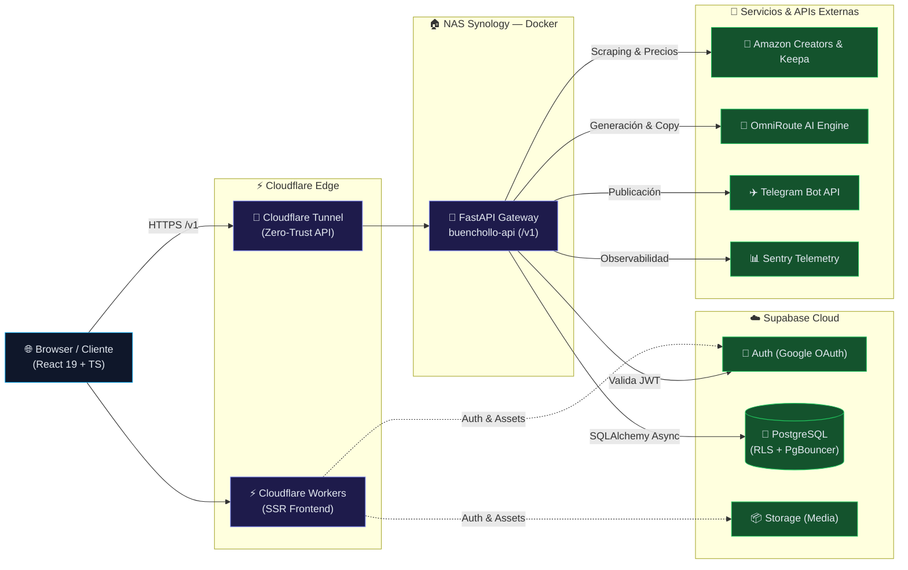

<p align="center">
  
</p>

<h1 align="center">BuenCholloTech</h1>

<p align="center">
  <strong>Plataforma Web Fullstack de Ofertas Tecnológicas, IA y Comunidad en Producción</strong><br>
  <em>Arquitectura profesional de alto rendimiento · Despliegue Edge en Cloudflare + Serverless NAS</em>
</p>

<p align="center">
  <a href="https://buenchollotech.com">
    
  </a>
  <a href="https://github.com/Zambudio/buenchollo-app/actions/workflows/ci.yml">
    
  </a>
  
  
</p>

<p align="center">
  
  
  
  
  
  
  
</p>

---

## 🌟 Visión General

**BuenCholloTech** es una plataforma web en producción de alta tecnología diseñada para la agregación, curación y automatización comunitaria de **ofertas y productos tecnológicos**.

Construida con un nivel de rigor de ingeniería de software senior, combina la curación experta con **enriquecimiento inteligente mediante Inteligencia Artificial (OmniRoute / OpenAI)**, **alertas en tiempo real**, **scraping automatizado de precios (Amazon / Keepa)**, **difusión multicanal a Telegram** y un **módulo editorial de Blog con editor Tiptap**.

> ⚡ **Live Demo**: [buenchollotech.com](https://buenchollotech.com)  
> 🔗 **API Gateway Docs**: [api.buenchollotech.com/docs](https://api.buenchollotech.com/docs)

---

## 🚀 Características y Desarrollos Destacados

<table>
<tr>
<td width="50%">

### 🤖 Motor de IA Unificado (OmniRoute)
Extracción de atributos, generación de copies persuasivos para Telegram y categorización automática. Integrado con fallback a modelos gratuitos y arquitectura extensible para asistentes conversacionales.

</td>
<td width="50%">

### 🛒 Autocompletado Amazon & Keepa
Pega una URL de Amazon y el sistema extrae automáticamente el **ASIN, título, precio, descuento, imágenes** e integra la **gráfica de historial de precios de Keepa** en tiempo real.

</td>
</tr>
<tr>
<td width="50%">

### ⏰ Motor de Tareas Programadas (Cron)
Servicio en background asíncrono para la **revisión automática de precios**, caducidad programada de ofertas y ejecución de tareas de mantenimiento recurrentes.

</td>
<td width="50%">

### ✍️ Módulo de Blog con Editor Tiptap
Plataforma de publicaciones técnicas y guías de compra con editor **WYSIWYG rich-text**, categorías dedicadas, hilos de comentarios y votaciones comunitarias.

</td>
</tr>
<tr>
<td width="50%">

### 🔔 Alertas & Notificaciones In-App
Motor de *matching* de alta velocidad en backend. Notifica a usuarios según criterios personalizados (precio máximo, % de descuento, palabras clave, marcas o tiendas).

</td>
<td width="50%">

### ✈️ Distribución Multicanal a Telegram
Integración nativa con **Telegram Bot API**. Permite previsualizar el mensaje formateado con Emojis Premium y publicarlo con un solo clic a canales o grupos.

</td>
</tr>
<tr>
<td width="50%">

### 🌐 Arquitectura Edge + Cloudflare Tunnel
Frontend desplegado serverless en **Cloudflare Workers** (SSR). Backend FastAPI en **NAS Synology** expuesto mediante **Cloudflare Tunnel (Zero-Trust)** sin abrir puertos en el router.

</td>
<td width="50%">

### 📊 Dashboard Admin & Audit Log
Panel de control con métricas agregadas (chollos, tráfico, usuarios, favoritas) y registro de auditoría inmutable (**`admin_audit_log`**) trazable por `request_id` único.

</td>
</tr>
</table>

---

## 🏛️ Arquitectura del Sistema

El sistema implementa un **Monolito Modular con Clean Architecture pragmática** ([ADR-001](docs/adr/ADR-001-monolito-modular-fastapi.md)) y un **API Gateway FastAPI** ([ADR-002](docs/adr/ADR-002-migracion-baas-a-api-gateway.md)). El cliente frontend se comunica de forma estricta a través de endpoints REST versionados (`/v1`).


```mermaid
flowchart LR
    Browser["🌐 Browser / Cliente<br/>(React 19 + TS)"]

    subgraph cloudflare ["⚡ Cloudflare Edge"]
        Workers["⚡ Cloudflare Workers<br/>(SSR Frontend)"]
        Tunnel["🔐 Cloudflare Tunnel<br/>(Zero-Trust API)"]
    end

    subgraph nas ["🏠 NAS Synology — Docker"]
        API["🐍 FastAPI Gateway<br/>buenchollo-api (/v1)"]
    end

    subgraph supa ["☁️ Supabase Cloud"]
        Auth["🔑 Auth (Google OAuth)"]
        DB[("🐘 PostgreSQL<br/>(RLS + PgBouncer)")]
        Storage["📦 Storage (Media)"]
    end

    subgraph ext ["🔌 Servicios & APIs Externas"]
        Amazon["🛒 Amazon Creators & Keepa"]
        AI["🤖 OmniRoute AI Engine"]
        Telegram["✈️ Telegram Bot API"]
        Sentry["📊 Sentry Telemetry"]
    end

    Browser --> Workers
    Browser -- "HTTPS /v1" --> Tunnel --> API
    Workers -. "Auth & Assets" .-> Auth & Storage

    API -- "SQLAlchemy Async" --> DB
    API -- "Valida JWT" --> Auth
    API -- "Scraping & Precios" --> Amazon
    API -- "Generación & Copy" --> AI
    API -- "Publicación" --> Telegram
    API -- "Observabilidad" --> Sentry

    classDef client fill:#0f172a,stroke:#0ea5e9,color:#e2e8f0
    classDef internal fill:#1e1b4b,stroke:#818cf8,color:#e2e8f0
    classDef ext fill:#14532d,stroke:#22c55e,color:#e2e8f0
    class Auth,DB,Storage,Amazon,AI,Telegram,Sentry ext
    class API,Workers,Tunnel internal
    class Browser client
```

---

## 🛠️ Principios de Ingeniería & Clean Architecture

El backend Python sigue la regla de **Inversión de Dependencias (DIP)** utilizando los `Protocols` nativos para mantener un acoplamiento nulo entre la infraestructura y las reglas de negocio.

```
buenchollo-api/app/modules/<dominio>/
├── domain/            # Reglas de negocio puras, modelos SQLAlchemy e interfaces (Protocols)
├── application/       # Casos de uso e orquestación de servicios (sin acoplamiento a HTTP)
├── infrastructure/    # Adaptadores externos (Amazon, OpenAI, Telegram, Repositorios SQL)
└── api/               # Router FastAPI, esquemas Pydantic y serialización HTTP
```

### 📜 6 Reglas de Diseño Inviolables

1. **HTTP Aislado**: El Router únicamente recibe peticiones HTTP, valida esquemas Pydantic y delega al Caso de Uso.
2. **Casos de Uso Independientes**: Ubicados en `application/`, sin conocimiento de FastAPI ni frameworks de transporte.
3. **Persistencia Encapsulada**: La capa de infraestructura (`repositories/`) es la única con permiso para interactuar con la Base de Datos.
4. **Desacoplamiento entre Dominios**: Los módulos no se importan cruzadamente de forma directa; lo compartido reside en `core/`.
5. **Inversión de Dependencias**: Cualquier integración de terceros (Amazon, Telegram, IA) implementa una interfaz definida en el dominio.
6. **Frontera de Seguridad Restringida**: La base de datos no es accesible directamente desde el cliente.

---

## 📋 ADRs (Architecture Decision Records)

El proyecto cuenta con **13 ADRs formalizados** que documentan el contexto y la justificación de cada hito técnico:

| # | Título | Decisión | Estado |
|---|---|---|---|
| [ADR-001](docs/adr/ADR-001-monolito-modular-fastapi.md) | Monolito Modular con FastAPI | Clean Architecture pragmática por dominios | ✅ Aceptado |
| [ADR-002](docs/adr/ADR-002-migracion-baas-a-api-gateway.md) | Eliminación de llamadas BaaS directas | Frontend habla únicamente con FastAPI Gateway | ✅ Cumplido |
| [ADR-003](docs/adr/ADR-003-autenticacion-supabase-jwt.md) | Autenticación basada en Supabase Auth | Validación de tokens JWT en backend server-side | ✅ Aceptado |
| [ADR-004](docs/adr/ADR-004-persistencia-sqlalchemy-pgbouncer.md) | Persistencia Asíncrona | SQLAlchemy 2 async + asyncpg + PgBouncer pooler | ✅ Aceptado |
| [ADR-005](docs/adr/ADR-005-validacion-doble-frontera.md) | Validación en Doble Frontera | Zod en cliente (UX) + Pydantic v2 en servidor (Seguridad) | ✅ Aceptado |
| [ADR-006](docs/adr/ADR-006-rls-service-role.md) | Hardening de Base de Datos | Row Level Security (RLS) en 12 tablas + service_role key | ✅ Aceptado |
| [ADR-007](docs/adr/ADR-007-di-fastapi-depends.md) | Inyección de Dependencias | Inyección nativa con `Depends` de FastAPI | ✅ Aceptado |
| [ADR-008](docs/adr/ADR-008-estrategia-calidad-testing.md) | Estrategia de Calidad y Testing | Pirámide de testing 100/80/0 + Quality Gates | ✅ Aceptado |
| [ADR-009](docs/adr/ADR-009-uso-de-ia-en-desarrollo.md) | Desarrollo Asistido por IA | Uso supervisado de Claude Code con reglas en `CLAUDE.md` | ✅ Aceptado |
| [ADR-010](docs/adr/ADR-010-validacion-jwt-local.md) | Optimización de Verificación JWT | Decodificación local mediante claves públicas de Supabase | ✅ Aceptado |
| [ADR-011](docs/adr/ADR-011-blog-tiptap-editor.md) | Motor de Contenido y Blog | Integración de editor WYSIWYG Tiptap + comentarios | ✅ Aceptado |
| [ADR-012](docs/adr/ADR-012-motor-tareas-programadas.md) | Motor Asíncrono de Crons | Scheduled tasks engine en background sin dependencias pesadas | ✅ Aceptado |
| [ADR-013](docs/adr/ADR-013-motor-ia-unificado-omniroute-modelos-gratuitos.md) | OmniRoute AI Engine | Router unificado de modelos LLM con fallback resiliente | ✅ Aceptado |

---

## ⚡ Stack Tecnológico

| Capa | Tecnologías | Propósito |
|---|---|---|
| **Frontend** | React 19 · TypeScript Strict · Vite · TanStack Router · TanStack Query · Tailwind CSS · shadcn/ui · Tiptap Editor | UI/UX interactiva de alto rendimiento con SSR en Edge |
| **Backend** | Python 3.11 · FastAPI 0.136 · SQLAlchemy 2.0 Async · asyncpg · Pydantic v2 · SlowAPI | API Gateway asíncrono de alta velocidad |
| **Persistencia & Auth** | PostgreSQL (Supabase Managed) · Supabase Auth (Google OAuth) · Supabase Storage | Base de datos relacional con RLS, autenticación y storage |
| **Edge & Cloud** | Cloudflare Workers · Cloudflare Tunnel · Cloudflare WAF · Let's Encrypt | Despliegue global en Edge con túnel Zero-Trust hacia el NAS |
| **Integraciones** | Amazon Creators API · Keepa API · OpenAI GPT-4o / OmniRoute · Telegram Bot API · Sentry SaaS | Extracción de datos, IA, notificaciones push y telemetría |
| **DevOps & QA** | GitHub Actions · Docker & Compose · Husky · Vitest · Playwright · Alembic | Pipeline CI/CD automatizado, tests y migraciones |

---

## 🧪 Estrategia de Testing & Calidad

> 📊 **237 Tests Automatizados Verdes** (127 Pytest + 102 Vitest + 8 E2E Playwright).

```bash
# 🐍 Ejecución de Suite Backend (Unitarios + Seguridad)
cd buenchollo-api
pytest -q -m "not integration"

# 🧪 Ejecución de Suite Frontend (Unitarios + Componentes)
cd buenchollo-web
npm run test:run

# 🎭 Pruebas End-to-End (E2E)
cd buenchollo-web
npm run test:e2e

# 🛡️ Pipeline Completo de Calidad (Typecheck + Lint + Tests)
npm run quality:full
```

---

## 🛡️ Seguridad & DevSecOps

- **Security by Design**: Superficie de ataque reducida mediante API Gateway.
- **Defensa en Profundidad**: RLS (Row Level Security) activado en las 12 tablas de PostgreSQL.
- **Protección HTTP**: Headers de seguridad aplicados globalmente (`CSP`, `HSTS`, `X-Frame-Options`, `X-Content-Type-Options`, `Referrer-Policy`).
- **Mitigación DoS & SSRF**: Rate limiting adaptativo con SlowAPI y allowlist estricta de dominios para la extracción de ofertas.
- **Auditoría DevSecOps**: CI integrado con `pip-audit`, `npm audit` y escaneo de secretos.

---

## 💻 Desarrollo Local

```bash
# 1. Clonar el repositorio
git clone https://github.com/Zambudio/buenchollo-app.git
cd buenchollo-app

# 2. Configurar Hooks de Husky
npm install

# 3. Inicializar Backend (Python 3.11)
cd buenchollo-api
python -m venv .venv
.venv\Scripts\Activate.ps1   # Windows (o source .venv/bin/activate en Linux/macOS)
pip install -r requirements-dev.txt
cp .env.example .env         # Configurar credenciales
uvicorn app.main:app --reload --port 8000

# 4. Inicializar Frontend (en otra terminal)
cd buenchollo-web
npm install
cp .env.example .env.local   # Configurar endpoints
npm run dev
```

---

## 🗺️ Índice de Documentación (`docs/`)

- [`docs/project/`](docs/project/00-index.md): **Guía Operativa del Proyecto** (Setup, Estructura, Configuración, Deployment).
- [`docs/master/`](docs/master/00-index.md): **Especificación de Arquitectura y Diseño Técnico** (10 Capítulos exhaustivos).
- [`docs/adr/`](docs/adr/00-index.md): ** Architecture Decision Records** (ADR-001 al ADR-013).
- [`docs/guides/`](docs/guides/): **Guías Operativas en Vivo** (Cloudflare Setup, NAS-SSH Deployment, Migraciones Alembic).

---

## 👤 Autor

**Pedro Zambudio** — *Fullstack Software Engineer & AI Systems Architect*

- 🌐 **Web en Producción**: [buenchollotech.com](https://buenchollotech.com)
- 🐙 **GitHub**: [@Zambudio](https://github.com/Zambudio)
- 📧 **Contacto / Email**: `pjzambudio@gmail.com`
